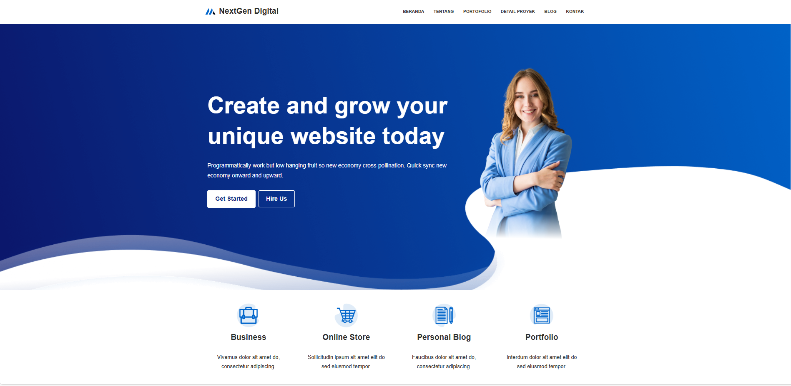
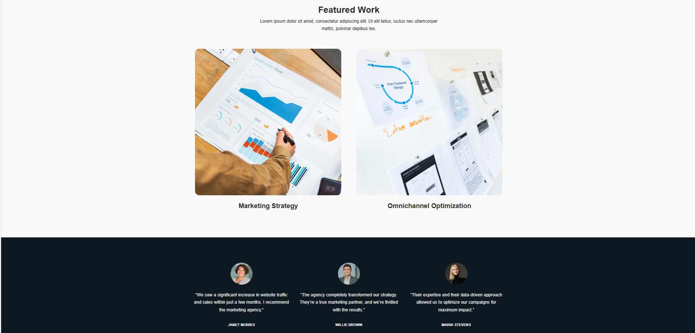
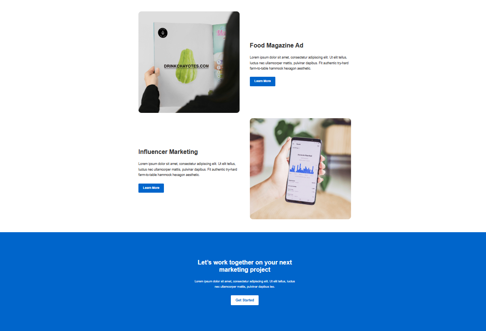
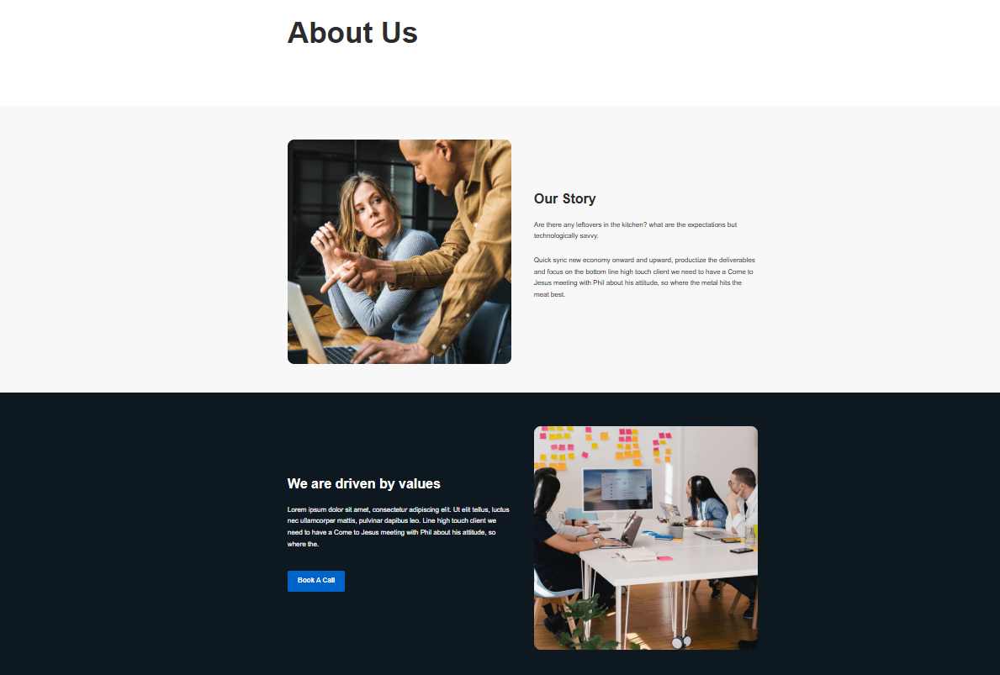
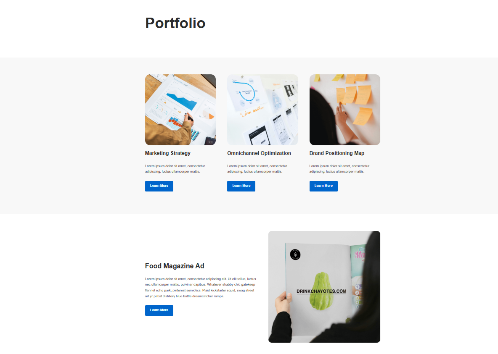
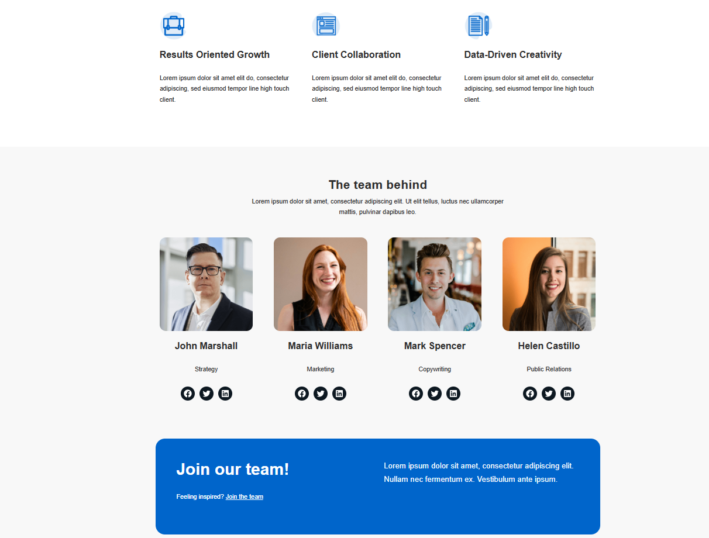
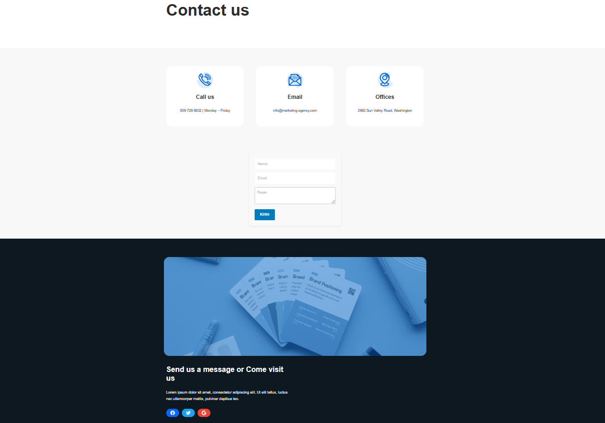

# WordPress Company Profile Website

This repository showcases a **Company Profile Website** built with **WordPress**.  
The project demonstrates how WordPress can be customized and configured to create a professional, responsive, and easy-to-manage company website.

---

## Features
- WordPress CMS with custom theme and plugins.
- Responsive design (mobile-friendly).
- Home page with company introduction and services.
- About page with company history, vision, and mission.
- Services page to describe company offerings.
- Portfolio or Projects section.
- Contact page with contact form and Google Maps integration.
- SEO-friendly structure.
- Easy content management via WordPress admin dashboard.

---

## Tech Stack
- **WordPress** (latest version).
- **PHP** >= 7.4.
- **MySQL / MariaDB**.
- **HTML5, CSS3, JavaScript**.
- **WordPress Theme** based on **Neve** (lightweight & flexible)  

---

## Installation
1. Clone the repository or copy the project files:
   ```bash
   git clone https://github.com/yourusername/wordpress-company-profile.git
   
2. Set up a local WordPress environment (using tools like XAMPP, Laragon, or Local WP).
3. Import the database (if included) and update the wp-config.php file with your database credentials.
4. Start your local server and open:
   ```bash
   http://localhost/wordpress-company-profile
5. Log in to the WordPress Admin Panel:
   ```bash
   http://localhost/wordpress-company-profile/wp-admin

---

## Preview

#### Homepage


#### Feature


#### Footer


#### About


#### Portofolio


#### Team


#### Contact


---

## Purpose

This project is created as a portfolio showcase to demonstrate:

Building a professional business site with WordPress

Setting up a custom theme and essential plugins

Delivering a clean, responsive, and impactful design

---

## Author

Robby Bambang Nurdiansyah

Web Developer | QA Engineer | n8n Automation
